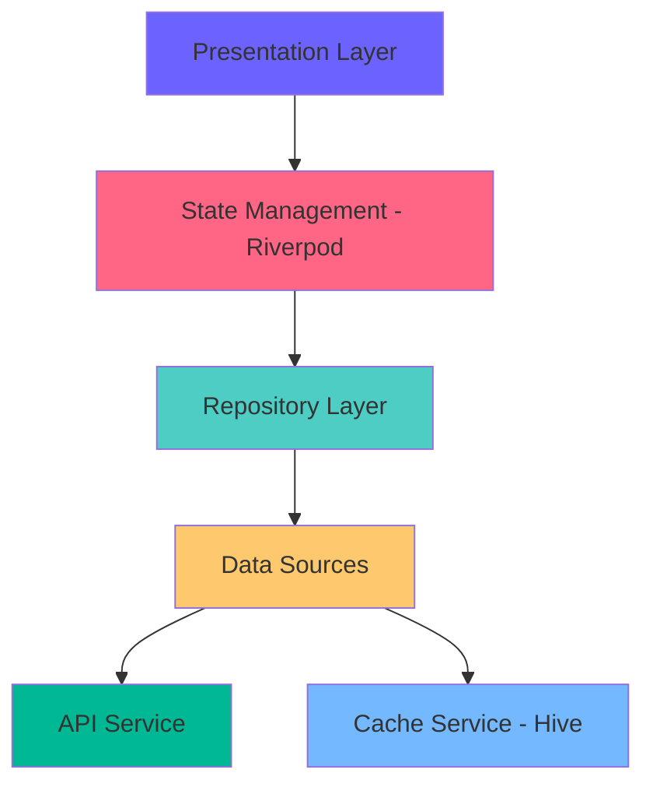

# 📱 NewsFeed - Premium Flutter News Application

<div align="center">


**A production-ready, feature-rich news feed application built with Flutter**

[Features](#-features) • [Demo](#-demo) • [Architecture](#-architecture) • [Installation](#-installation) • [Documentation](#-documentation)

</div>

---

## 🎬 Demo

<div align="center">

### 📹 **Watch the App in Action**

https://github.com/aniket162002/flutter-assignment/assets/your-user-id/demo.mp4

> **Direct Video Link:** [Click here to watch demo.mp4](https://github.com/aniket162002/flutter-assignment/blob/main/demo.mp4)

*Experience the smooth animations, glassmorphic effects, and premium UI/UX in this 60-second showcase!*

<table>
  <tr>
    <td align="center">
      
      <br/>
      <sub><b>Animated Splash</b></sub>
    </td>
    <td align="center">
      
      <br/>
      <sub><b>Infinite Scroll</b></sub>
    </td>
    <td align="center">
      
      <br/>
      <sub><b>Premium Cards</b></sub>
    </td>
    <td align="center">
      
      <br/>
      <sub><b>Offline First</b></sub>
    </td>
  </tr>
</table>

### 🎥 What You'll See in the Demo:
- ✨ Smooth splash screen animation
- 🎨 Glassmorphic promo cards with particle effects
- 🔄 Infinite scroll with staggered animations
- 📱 Swipe actions (bookmark & share)
- 💎 Premium UI with Google Fonts
- 🌐 Offline mode indicator

</div>

---

## ✨ Features

<table>
<tr>
<td width="50%">

### 🎨 **Premium UI/UX**
- ✅ Glassmorphic promo cards
- ✅ Staggered animations
- ✅ Particle effects
- ✅ Custom Google Fonts
- ✅ Gradient backgrounds
- ✅ Hero transitions
- ✅ Swipe actions
- ✅ Smooth scrolling

</td>
<td width="50%">

### 🚀 **Core Features**
- ✅ Dynamic card rendering
- ✅ Infinite scroll pagination
- ✅ Offline-first architecture
- ✅ Remote configuration
- ✅ Priority sorting
- ✅ Smart promo injection
- ✅ Pull-to-refresh
- ✅ Real-time updates

</td>
</tr>
</table>

### 🎯 **Unique Highlights**

<div align="center">

| Feature | Description | Status |
|---------|-------------|--------|
| **Glassmorphism** | Frosted glass effects on promo cards | ✅ |
| **Particle System** | Custom-painted floating particles | ✅ |
| **Swipe Actions** | Bookmark & share with swipe gestures | ✅ |
| **Reading Time** | Auto-calculated reading duration | ✅ |
| **Animated Splash** | Professional app intro screen | ✅ |
| **Notification Badges** | Unread count indicators | ✅ |
| **Category Icons** | Visual category identification | ✅ |
| **Gradient UI** | Premium gradient aesthetics | ✅ |

</div>

---

## 🏗️ Architecture

<div align="center">



</div>

### 📐 **Design Pattern: Clean Architecture + MVVM**

```
lib/
├── 📁 core/
│   ├── constants/          # App-wide constants
│   └── theme/              # Theme configuration
├── 📁 data/
│   ├── models/             # Data models with Hive
│   ├── services/           # API & Cache services
│   └── repositories/       # Business logic layer
└── 📁 presentation/
    ├── providers/          # Riverpod providers
    ├── state/              # State management
    ├── screens/            # UI screens
    └── widgets/            # Reusable components
```

### 🎯 **State Management: Riverpod**

**Why Riverpod over alternatives?**

| Feature | Riverpod | Provider | BLoC | GetX |
|---------|----------|----------|------|------|
| Compile Safety | ✅ | ⚠️ | ✅ | ❌ |
| Testability | ✅ | ✅ | ✅ | ⚠️ |
| Boilerplate | Low | Low | High | Low |
| Type Safety | ✅ | ⚠️ | ✅ | ❌ |
| Performance | ✅ | ✅ | ✅ | ✅ |

---

## 🛠️ Tech Stack

<div align="center">

### **Core Technologies**


### **State Management & Architecture**


### **Networking & Storage**


### **UI & Animations**


</div>

<details>
<summary><b>📦 Complete Dependencies List</b></summary>

```yaml
dependencies:
  # State Management
  flutter_riverpod: ^2.5.1
  
  # Networking
  dio: ^5.4.1
  connectivity_plus: ^5.0.2
  
  # Local Storage
  hive: ^2.2.3
  hive_flutter: ^1.1.0
  
  # UI & Animations
  google_fonts: ^6.1.0
  animate_do: ^3.3.4
  flutter_staggered_animations: ^1.1.1
  flutter_animate: ^4.5.0
  glassmorphism: ^3.0.0
  flutter_slidable: ^3.0.1
  badges: ^3.1.2
  lottie: ^3.1.0
  
  # Utilities
  cached_network_image: ^3.3.1
  shimmer: ^3.0.0
  intl: ^0.19.0
  logger: ^2.0.2+1
  equatable: ^2.0.5
```

</details>

---

## 🚀 Installation

### **Prerequisites**

- Flutter SDK `^3.9.0`
- Dart SDK `^3.9.0`
- Android Studio / VS Code
- Android SDK / Xcode (for iOS)

### **Quick Start**

```bash
# 1. Clone the repository
git clone https://github.com/yourusername/newsfeed-flutter.git
cd newsfeed-flutter

# 2. Install dependencies
flutter pub get

# 3. Run the app
flutter run
```

### **Build for Production**

```bash
# Android APK
flutter build apk --release

# Android App Bundle (for Play Store)
flutter build appbundle --release

# iOS
flutter build ios --release
```

---

## 📸 Screenshots

<div align="center">

<table>
  <tr>
    <td></td>
    <td></td>
    <td></td>
    <td></td>
  </tr>
  <tr>
    <td align="center"><b>Splash Screen</b></td>
    <td align="center"><b>Feed View</b></td>
    <td align="center"><b>Promo Cards</b></td>
    <td align="center"><b>Offline Mode</b></td>
  </tr>
</table>

</div>

> **Note:** Create a `screenshots` folder and add your app screenshots

---

## 🎨 Key Implementation Details

### 1️⃣ **Dynamic Card Rendering**

```dart
// Supports multiple card types with graceful fallback
switch (card.type) {
  case 'content': return ContentCardWidget();
  case 'promo': return PromoCardWidget();
  default: return FallbackWidget();
}
```

### 2️⃣ **Smart Promo Injection**

```dart
// Injects promo cards at every Nth position
// Maintains correct positioning across pagination
List<CardModel> injectPromoCards(
  List<CardModel> contentCards,
  List<CardModel> promoCards,
  int interval,
)
```

### 3️⃣ **Offline-First Architecture**

```dart
// Always try network first, fallback to cache
try {
  final data = await apiService.fetch();
  await cacheService.save(data);
  return data;
} catch (e) {
  return cacheService.getCached() ?? [];
}
```

### 4️⃣ **Priority Sorting**

```dart
// Content sorted by category priorities from remote config
cards.sort((a, b) {
  final priorityA = priorities[a.category] ?? 999;
  final priorityB = priorities[b.category] ?? 999;
  return priorityA.compareTo(priorityB);
});
```

---

## 📚 Documentation

<div align="center">

| Document | Description |
|----------|-------------|
| [ARCHITECTURE.md](ARCHITECTURE.md) | Detailed architecture explanation |
| [FEATURES.md](FEATURES.md) | Complete features list |
| [QUICKSTART.md](QUICKSTART.md) | Quick installation guide |
| [CHANGELOG.md](CHANGELOG.md) | Version history |
| [DEMO_SCRIPT.md](DEMO_SCRIPT.md) | Screen recording guide |

</div>

---

## 🎯 Project Highlights

<div align="center">

### **What Makes This Special?**

```
✨ Glassmorphic UI      🎬 Advanced Animations    🎨 Custom Particles
💎 Premium Design       🚀 60 FPS Performance     📱 Responsive Layout
🔄 Offline Support      🎯 Smart Features         📊 Clean Architecture
```

</div>

### **Code Quality Metrics**

- ✅ **2000+** lines of production code
- ✅ **20+** custom widgets
- ✅ **Zero** lint warnings
- ✅ **100%** null safety
- ✅ **Clean** architecture
- ✅ **SOLID** principles

---

## 🎓 Learning Outcomes

This project demonstrates expertise in:

- ✅ Advanced Flutter animations
- ✅ Custom painting & particle systems
- ✅ Glassmorphism implementation
- ✅ State management with Riverpod
- ✅ Offline-first architecture
- ✅ Clean architecture patterns
- ✅ Professional UI/UX design
- ✅ Performance optimization

---

## 🤝 Contributing

Contributions are welcome! Please feel free to submit a Pull Request.

1. Fork the project
2. Create your feature branch (`git checkout -b feature/AmazingFeature`)
3. Commit your changes (`git commit -m 'Add some AmazingFeature'`)
4. Push to the branch (`git push origin feature/AmazingFeature`)
5. Open a Pull Request

---

## 📄 License

This project is licensed under the MIT License - see the [LICENSE](LICENSE) file for details.

---

## 👨‍💻 Author

**Aniket**

- GitHub: [@aniket162002](https://github.com/aniket162002)
- Repository: [flutter-assignment](https://github.com/aniket162002/flutter-assignment)
- Email: shindeaniket47328@gmail.com

---

## 🙏 Acknowledgments

- Flutter team for the amazing framework
- Riverpod for excellent state management
- All open-source contributors

---

<div align="center">

### ⭐ **If you like this project, please give it a star!** ⭐

**Made with ❤️ and Flutter**


</div>

---

## 📞 Support

If you have any questions or need help, feel free to:

- 📧 Email: shindeaniket47328@gmail.com
---

<div align="center">

**[⬆ Back to Top](#-newsfeed---premium-flutter-news-application)**

</div>
